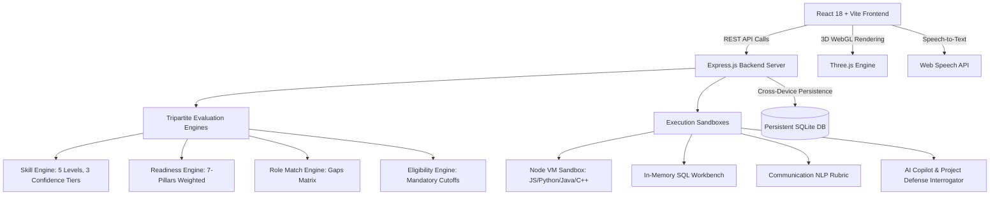

# 🎯 Skill-O-Scope

<div align="center">

### **“Measure Your Skills. Discover Your Potential. Build Your Career.”**

An **AI-Powered Career & Hiring Intelligence Platform** for college students, university placement cells (TPOs), and technical recruiters.

[](https://nodejs.org/)
[](https://react.dev/)
[](https://vitejs.dev/)
[](https://threejs.org/)
[](https://tailwindcss.com/)
[]()
[]()

</div>

---

## 📖 1. Core Purpose

Skill-O-Scope is **NOT a traditional job portal**. It fundamentally solves the question:

> **“I want this career/job/company. What exactly do I need to get hired, and how strong am I right now?”**

### Core Philosophy
> **“We don't just ask what you know. We measure what you can demonstrate.”**

Skill-O-Scope replaces unverified resume checkboxes with **multi-source verifiable engineering evidence** across coding sandboxes, database workbenches, AI project defenses, and NLP communication evaluations.

---

## 🏛️ 2. The Tripartite Evaluation Model

Never confuse eligibility with readiness or role match:

```
┌────────────────────────────────────────────────────────────────────────────────────────┐
│                                   TRIPARTITE MODEL                                     │
├─────────────────────────┬──────────────────────────────┬───────────────────────────────┤
│    1. ELIGIBILITY       │        2. READINESS          │        3. ROLE MATCH          │
│     “Can I apply?”      │    “How prepared am I?”      │  “How closely does my profile │
│                         │                              │   match this specific role?”  │
├─────────────────────────┼──────────────────────────────┼───────────────────────────────┤
│ Mandatory cutoffs:      │ 7-Pillars Weighted Score:    │ Domain fit & gap analysis:    │
│ • Degree & Branch       │ • DSA & Problem Solving (25%)│ • Mandatory Skills Fit (50%)  │
│ • Graduation Batch      │ • Core Programming Lab (20%) │ • Recommended Skills (35%)    │
│ • Min CGPA Cutoff       │ • System Projects & Def (15%)│ • Differentiators (15%)       │
│ • Active Backlogs Limit │ • CS Fundamentals (15%)      │                               │
│ • Mandatory Skills      │ • Database & SQL (10%)       │ Result:                       │
│                         │ • Communication & Mock (10%) │ Software Engineer Match: 84%  │
│ Status:                 │ • Academic Profile (5%)      │                               │
│ 🟢 Eligible             │                              │                               │
│ 🟡 Evidence Incomplete  │ Result:                      │                               │
│ 🔴 Not Satisfied        │ Placement Readiness: 76%     │                               │
└─────────────────────────┴──────────────────────────────┴───────────────────────────────┘
```

---

## 🔬 3. Evidence Confidence Hierarchy

Every skill displays its verified provenance and confidence tier:

* **Low Confidence (Self-Declared)**: Initialized via resume mention or profile checkbox (e.g. *Python — Self-Declared — 55/100*). Capped at intermediate levels.
* **Medium Confidence (Demonstrated)**: Supported by 1 verified source (e.g. *1 Coding Lab test or 1 project claim*).
* **High Confidence (Multi-Source Verified)**: Validated across 2+ independent engineering assessments (e.g. *Coding Lab 86% + AI Project Defense 88% + Technical Mock Interview 82%*).

---

## 🚀 4. Platform Features & Labs

### 🌐 3D Interactive Readiness Sphere (Three.js WebGL)
- Central dynamic glowing sphere that changes color based on overall readiness (Electric Lime `#B7E36A` $\ge 80\%$, Solar Yellow `#FFE66D` $60-79\%$, Tangerine Coral `#FF7A59` $<60\%$).
- 8 revolving skill satellite nodes (**Python, DSA, SQL, Communication, Projects, CS Fundamentals, Problem Solving, Interview**) with orbital raycasting and interactive hover cards.

### 💻 Evidence-Based Coding Lab
- Multi-language support: **Python 3, JavaScript (Node VM), Java 17, C++ 20**.
- Multi-test case runner with runtime execution timing (ms), simulated memory metrics (MB), and algorithmic feedback.

### 🗄️ SQL Practice & Assessment Workbench
- Controlled relational schema tables: `Students`, `Departments`, `Employees`, `Customers`, `Orders`, `Products`.
- Executes and evaluates queries with `JOINs`, `GROUP BY`, `HAVING`, `WHERE`, `ORDER BY`, and aggregate functions.

### 🎙️ Communication Lab (Speech-to-Text & NLP Rubric)
- Microphone audio recording via Web Speech API + text transcript editor.
- Measures **Relevance, Structure (STAR method), Clarity, Vocabulary Depth, Filler Words Frequency** (`um`, `uh`, `like`), and **Speaking Pace (WPM)**.
- **Strictly Bias-Free Guarantee**: Analyzes semantic structure only, never inferring appearance, accent, or personality.

### 🛡️ AI Project Defense Studio
- Add projects with repository URLs and architectural descriptions.
- Dynamic AI Interrogation generates trade-off questions (*"Why MongoDB over PostgreSQL?", "How do you handle token expiration?", "How would you handle 10,000 concurrent writes?"*).
- Upgrades claimed skills to **Demonstrated** upon defense completion.

### 🤖 AI Placement Mock Interview Studio
- Multi-turn interactive conversational simulation (**Technical, HR, Behavioral STAR, System Design**).
- Follow-up questioning based on previous answers, culminating in a comprehensive scoring report.

### 🧭 Career Explorer & Company Intelligence
- 13+ in-depth tech careers with *Mandatory*, *Recommended*, and *Differentiator* skill classifications.
- Company Profiles distinguishing **Official Employer Requirements** from **Generalized Guidance**.
- Side-by-Side Company Comparison Matrix.
- Custom **Job Description (JD) Analyzer** with match percentage and gap detection.

### 👔 Recruiter Portal
- Campus Talent Acquisition dashboard with open job management.
- Evidence-Based Talent Search with bias-free ranking.
- Deep Score Explainability modal (**Why 91%?** with full verified evidence provenance).
- Visual 7-Stage **Kanban Hiring Pipeline** (*Applied → Matched → Shortlisted → Assessment → Tech Interview → HR → Offer*).

### 🎓 TPO / Admin Portal
- College Placement Overview with readiness distribution.
- **Institutional Skill Gap Heatmap** across engineering departments (**CSE, IT, ECE, EEE, Mechanical, Civil**).
- Training Program Recommendations & Workshop Scheduler.
- **AI Placement Readiness Forecast** (*AI Estimate — Not a Guarantee*).

### 💬 AI Career Copilot (Floating Assistant)
- Real-time conversational assistant connected to the student's live dossier for customized mentorship, roadmap guidance, and diagnostic answers.

---

## 🛠️ 5. Technology Stack & Architecture



---

## 📦 6. Installation & Local Setup

### Prerequisites
- [Node.js](https://nodejs.org/) (version 18.x or 20.x recommended)
- [npm](https://www.npmjs.com/) (version 9.x or higher)

### Quick Start
```bash
# 1. Clone the repository
git clone https://github.com/YOUR_USERNAME/skill-o-scope.git
cd skill-o-scope

# 2. Install root and backend dependencies
npm install

# 3. Install client frontend dependencies
npm --prefix client install

# 4. Build client production assets
npm --prefix client run build

# 5. Start the fullstack platform
npm start
```

Open your browser and navigate to **`http://localhost:5000`**.

---

## 🧪 7. Running Automated Tests

Skill-O-Scope comes with a comprehensive automated test suite verifying all REST endpoints, sandbox runners, SQL execution, NLP rubrics, and explainability engines:

```bash
node server/test_suite.js
```

```
====================================================
🚀 SKILL-O-SCOPE COMPREHENSIVE AUTOMATED TEST SUITE
====================================================
 ✅ PASS: API Health Endpoint
 ✅ PASS: Student Dossier & Tripartite Model Verification
 ✅ PASS: Coding Lab: Multi-Test Case Sandbox Runner
 ✅ PASS: SQL Lab: Realistic Relational Database Executor
 ✅ PASS: Communication Lab: NLP Speech-to-Text Rubric
 ✅ PASS: JD Analyzer: Requirements Extraction & Missing Gap Audit
 ✅ PASS: AI Career Copilot: Live Context-Aware Advice
 ✅ PASS: Recruiter Portal: Bias-Free Explainable Candidate Match
 ✅ PASS: TPO Portal: Institutional Heatmap & AI Forecast
====================================================
📊 TEST SUITE SUMMARY: 9 PASSED / 0 FAILED (100% PASS RATE)
====================================================
```

---

## 🚀 8. Production Deployment

### Option A: Render / Railway / Heroku
Skill-O-Scope includes unified single-port serving. Simply set:
* **Build Command**: `npm install && npm --prefix client install && npm --prefix client run build`
* **Start Command**: `npm start`
* **Port**: `5000` (or dynamic `PORT` provided by host)

### Option B: Docker
```dockerfile
FROM node:20-alpine
WORKDIR /app
COPY package*.json ./
RUN npm install
COPY client/package*.json client/
RUN npm --prefix client install
COPY . .
RUN npm --prefix client run build
EXPOSE 5000
CMD ["npm", "start"]
```

---

## 📄 9. License

This project is licensed under the MIT License — see the [LICENSE](LICENSE) file for details.

<div align="center">
  <sub>Built with ❤️ for college students, university placement cells, and hiring teams.</sub>
</div>
